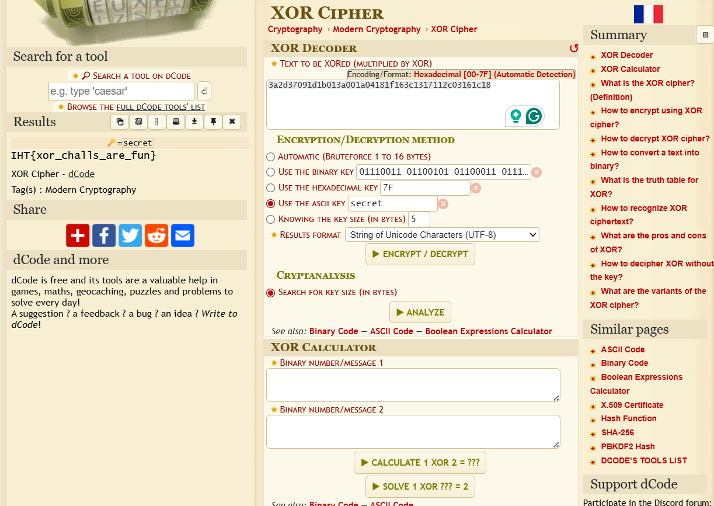

# Solution

---

## Step 1 - Getting the key

You’re given a file:

- challenge.txt

In the file there is an encrypted message and in the instructions, it says that it is encrypted using XOR. Now, all that is left is to figure out the key used for the encryption. In the challenge description, there was a hint stating "It is always a secret". The key to the XOR encryption is the word "secret". 
---

## Step 2 — Decrypt the message

Now, decrypt the message using the key "secret" using any online websites. Cyberchef doesnt have the option to use ASCII key.




You can also use a simple script

```
def xor_decrypt(cipher_hex: str, key: str) -> str:
    cipher_bytes = bytes.fromhex(cipher_hex)
    decrypted = ''
    for i in range(len(cipher_bytes)):
        decrypted += chr(cipher_bytes[i] ^ ord(key[i % len(key)]))
    return decrypted

cipher_hex = "150902151e0c1c173c110d151f09102d0406163a05070b09"
key = "secret"

plaintext = xor_decrypt(cipher_hex, key)
print(plaintext)
```

---
## Flag

```
flag{offsets_are_powerful}
```
