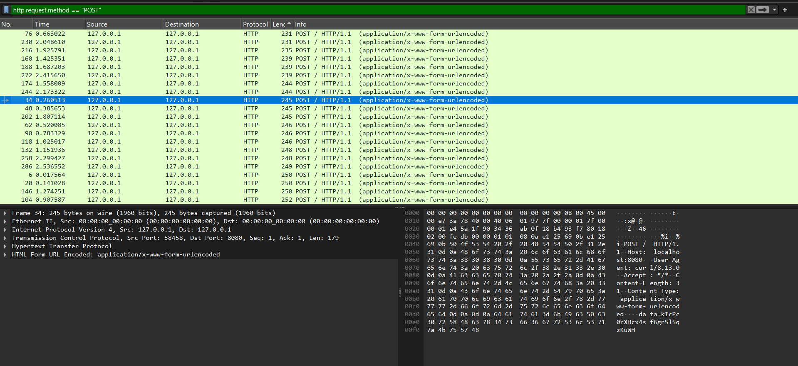
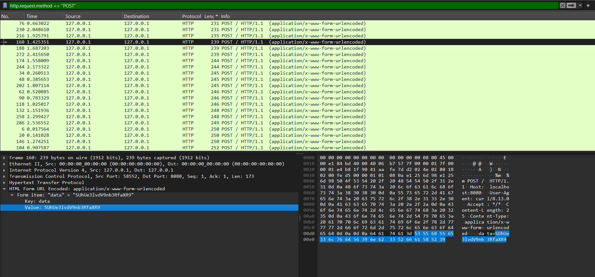
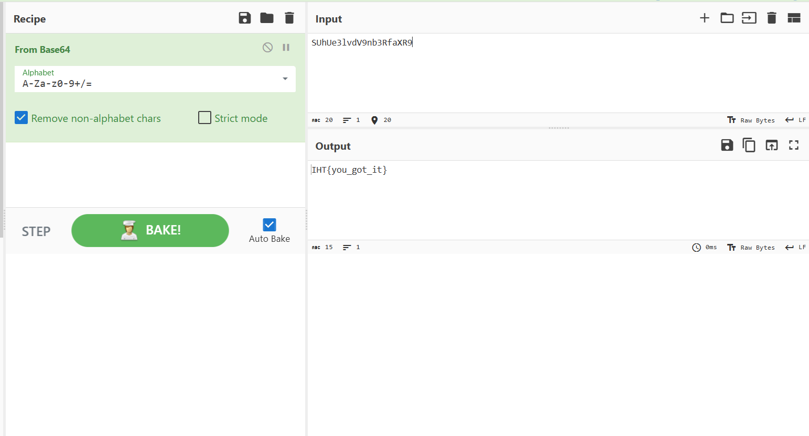

# Solution

---

## Step 1 — PCAP file

You’re given a file:

- `packet_whisperer.pcap`

Its a PCAP file, use tools like wireshark to read the file

---

## Step 2 — Filter by POST request 

The flag is hidden in the data of a POST request.

Filter the file by POST request



## Step 3 — Decrypt the data

Some of the data in the POST request are in Base64 and some arent. Decrypt them and you will eventually find the flag


Copy the value and put decrypt it from Base64


---

## Flag

```
IHT{you_got_it}
```
